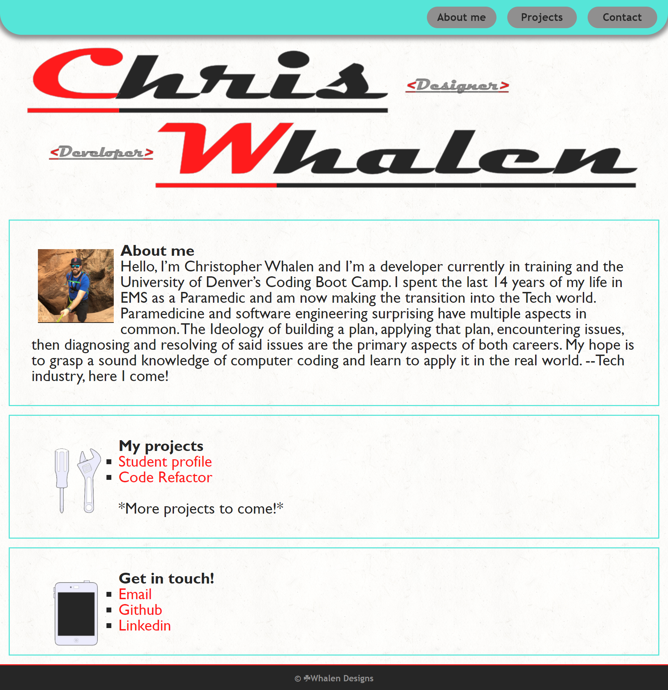

# 02-advanced-css-professional-portfolio

## Contributers
* Chris Whalen, Github: **[CobaltFrostfish](https://github.com/CobaltFrostfish)**

## Links
* **[Repository](https://github.com/CobaltFrostfish/professional-portfolio)**
* **[Live site](https://cobaltfrostfish.github.io/professional-portfolio/)**

## The project
Having a solid portfolio as a developer is akin to having a good RBI as a pro baseball player. Hence, why this project is a vital task to not only create but to grow and maintain along the way. I felt as though I used a lot of original code in this project. I feel mostly confident in the skills i learned and have utilized so far and I know that my skills can grow tremendously the more I practice. This is a good example of my skills thus far and I'm excited to see the changes I could possibly execute in the future.

## Technologies applied
* HTML
* CSS

## The final production:
